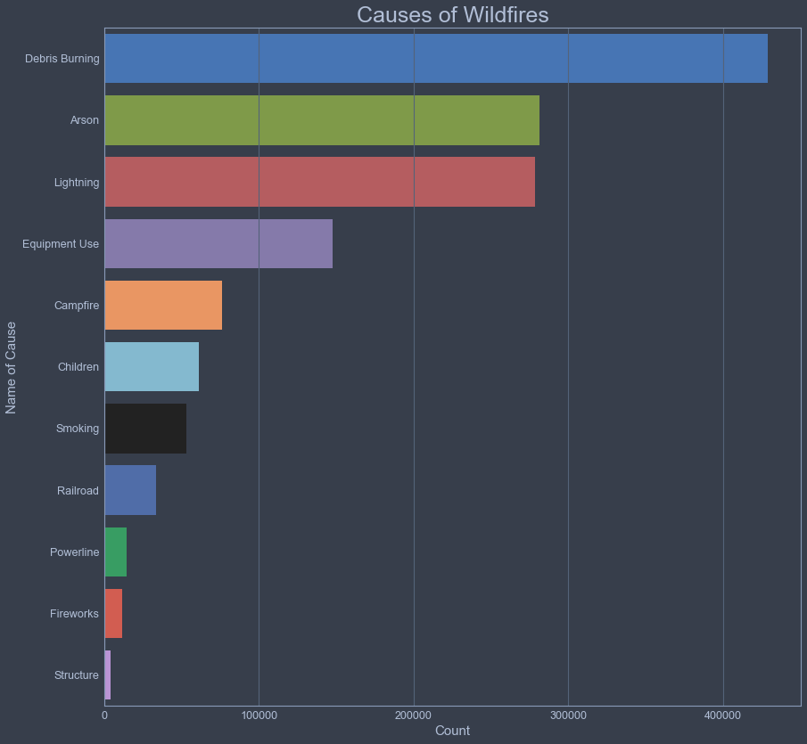
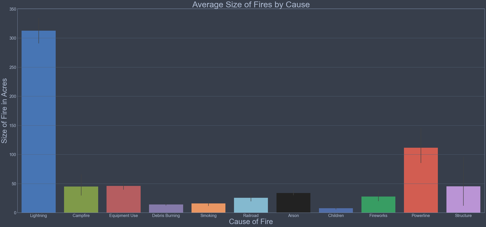
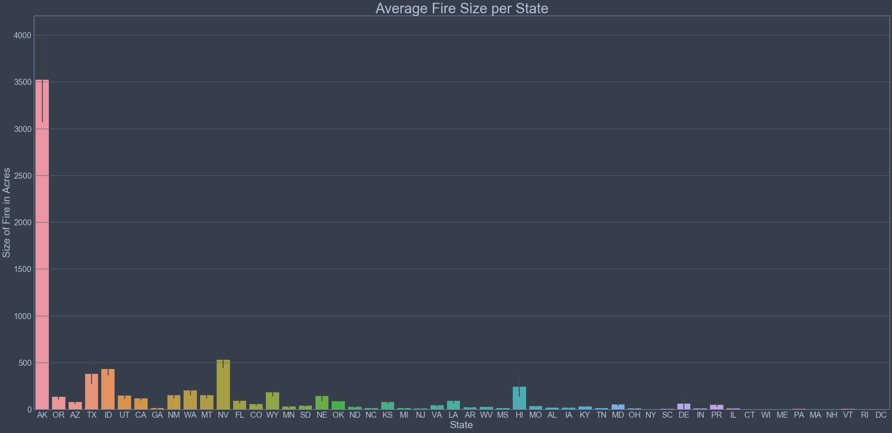

# **U.S. Wildfire Prediction**

# **Project Overview**

This notebook represents the final project in Module 5 of Flatiron's Data Science Bootcamp. Within this project contains a database of wildfires that occurred in the United States from 1992 to 2015. It's the third update of a publication originally generated to support the national Fire Program Analysis (FPA) system. The wildfire records were acquired from the reporting systems of federal, state, and local fire organizations. The following core data elements were required for records to be included in this data publication: discovery date, final fire size, and a point location. The resulting product, referred to as the Fire Program Analysis fire-occurrence database (FPA-FOD), includes 1.88 million geo-referenced wildfire records, representing a total of 140 million acres burned during the 24-year period.

While living in Los Angeles the previous two years, I experienced two of the most horrific wildfires in U.S. history. Thankfully I was safe from harm, however, many residents in Southern California were not. Thousands lost their homes and loved ones. This experience prompted me to analyze current wildfire data within the United States and to ask the following questions:

* Given the timing and location, can a machine learning algorithm predict the next cause and size of a wildfire?
* Which regions within the U.S. are the most and least fire-prone?
* Have wildfires become more or less frequent within this 24 year period?
* Have wildfires grown in regards to intensity and size?

## Framework

This project will follow a certain methodology, named OSEMiN, to build a best-fit model. OSEMiN suggests to follow certain relational steps to help us understand the data and build our model. These steps are listed below:

**Project Method (OSEMiN)**
* Obtain and load the dataset
* Scrub and clean the data
* Explore and understand the data value
* Model the data through testing processes
* Interpret the results and conclude

## Fire Program Analysis

The purpose of the Fire Program Analysis (FPA) system is to provide managers a common, interagency process for strategic fire management planning and budgeting. Data products and efforts derived from the FPA efforts were used in the National Strategy, such as the Wildfire Potential and Burn Probability data products, among others. The U.S. federal government’s planned response to the growing threat of nation wildfires was to launch this sophisticated new computer system, the FPA, that would enable firefighting agencies to coordinate their efforts and maximize their resources.

## About Wildfires

A wildfire is an uncontrolled fire occurring in wild, unpopulated areas, with the potential to spread into urban regions harming private homes, local agriculture, humans, and animals. Unfortunately, 90% of all wildfires are started by humans. Firefighters categorize wildfires into names such as surface fires, crown fires, spot fires, and ground fires. “Crown fires” are considered the most dangerous to civilization because they burn extremely hot, travel rapidly, and can change direction quickly from winds moving across the landscape. Weather conditions play a large role in the occurrence of wildfires through extended dry spells or drought in arid regions. Within these arid regions, the accumulation of dead matter (leaves, twigs, and trees) can create enough heat in some instances to spontaneously ignite the surrounding area. In an extreme case, rolling flames travel up to 14 miles an hour, which converts to about a four-minute mile pace, and can overtake the average human in minutes. 

According to National Geographic, destruction caused by wildfires in the United States has significantly increased in the last two decades. An average of 72,400 wildfires cleared an average of 7 million acres of U.S. land each year since 2000, double the number of acres scorched by wildfires in the 1990s. In 2015, the largest wildfire season recorded in U.S. history, wildfires burned more than 10 million acres of land. We shall see if the data collected by the Fire Program Analysis (FPA) broadcasts the same message.

## SQLAlchemy

The data for this project is stored within a SQLite database. For this project, I will be using SQLAlchemy to parse through the dataset. SQLAlchemy provides a “Pythonic” way of interacting with a database. Rather than dealing with the differences between specific dialects of MySQL or SQLite, you can leverage Python framework of SQLAlchemy to streamline your workflow and more efficiently query data. SQLAlchemy can be used to automatically load tables from a database using something called reflection. Reflection is the process of reading the database and building the metadata based on that information. Overall, it provides a full suite of well known enterprise-level persistence patterns, designed for efficient and high-performing database access, adapted into a simple and Pythonic language. 

# **Dataset**

This dataset is an SQLite database that contains the following information:

Fires: Table including wildfire data for the period of 1992-2015 compiled from US federal, state, and local reporting systems.

* FOD_ID = Global unique identifier.
* FPA_ID = Unique identifier that contains information necessary to track back to the original record in the source dataset.
* SOURCE_SYSTEM_TYPE = Type of source database or system that the record was drawn from (federal, nonfederal, or interagency).
* SOURCE_SYSTEM = Name of or other identifier for source database or system that the record was drawn from. 
* NWCG_REPORTING_AGENCY = Active National Wildlife Coordinating Group (NWCG) Unit Identifier for the agency preparing the fire report (BIA = Bureau of Indian Affairs, BLM = Bureau of Land Management, BOR = Bureau of Reclamation, DOD = Department of Defense, DOE = Department of Energy, FS = Forest Service, FWS = Fish and Wildlife Service, IA = Interagency Organization, NPS = National Park Service, ST/C&L = State, County, or Local Organization, and TRIBE = Tribal Organization).
* NWCG_REPORTING_UNIT_ID = Active NWCG Unit Identifier for the unit preparing the fire report.
* NWCG_REPORTING_UNIT_NAME = Active NWCG Unit Name for the unit preparing the fire report.
* SOURCE_REPORTING_UNIT = Code for the agency unit preparing the fire report, based on code/name in the source dataset.
* SOURCE_REPORTING_UNIT_NAME = Name of reporting agency unit preparing the fire report, based on code/name in the source dataset.
* LOCAL_FIRE_REPORT_ID = Number or code that uniquely identifies an incident report for a particular reporting unit and a particular calendar year.
* LOCAL_INCIDENT_ID = Number or code that uniquely identifies an incident for a particular local fire management organization within a particular calendar year.
* FIRE_CODE = Code used within the interagency wildland fire community to track and compile cost information for emergency fire suppression.
* FIRE_NAME = Name of the incident, from the fire report (primary) or ICS-209 report (secondary).
* FIRE_YEAR = Calendar year in which the fire was discovered or confirmed to exist.
* DISCOVERY_DATE = Date on which the fire was discovered or confirmed to exist.
* DISCOVERY_DOY = Day of year on which the fire was discovered or confirmed to exist.
* DISCOVERY_TIME = Time of day that the fire was discovered or confirmed to exist.
* STAT_CAUSE_CODE = Code for the (statistical) cause of the fire.
* STAT_CAUSE_DESCR = Description of the (statistical) cause of the fire.
* CONT_DATE = Date on which the fire was declared contained or otherwise controlled (mm/dd/yyyy where mm=month, dd=day, and yyyy=year).
* CONT_DOY = Day of year on which the fire was declared contained or otherwise controlled.
* CONT_TIME = Time of day that the fire was declared contained or otherwise controlled (hhmm where hh=hour, mm=minutes).
* FIRE_SIZE = Estimate of acres within the final perimeter of the fire.
* FIRE_SIZE_CLASS = Code for fire size based on the number of acres within the final fire perimeter expenditures (A=greater than 0 but less than or equal to 0.25 acres, B=0.26-9.9 acres, C=10.0-99.9 acres, D=100-299 acres, E=300 to 999 acres, F=1000 to 4999 acres, and G=5000+ acres).
* LATITUDE = Latitude (NAD83) for point location of the fire (decimal degrees).
* LONGITUDE = Longitude (NAD83) for point location of the fire (decimal degrees).
* OWNER_CODE = Code for primary owner or entity responsible for managing the land at the point of origin of the fire at the time of the incident.
* OWNER_DESCR = Name of primary owner or entity responsible for managing the land at the point of origin of the fire at the time of the incident.
* STATE = Two-letter alphabetic code for the state in which the fire burned (or originated), based on the nominal designation in the fire report.
* COUNTY = County, or equivalent, in which the fire burned (or originated), based on nominal designation in the fire report.
* GeographicArea = Two-letter code for the geographic area in which the unit is located (NA=National, IN=International, AK=Alaska, CA=California, EA=Eastern Area, GB=Great Basin, NR=Northern Rockies, NW=Northwest, RM=Rocky Mountain, SA=Southern Area, and SW=Southwest).
* WildlandRole = Role of the unit within the wildland fire community.
* UnitType = Type of unit (e.g., federal, state, local).
* Country = Country in which the unit is located (e.g. US = United States).
* State = Two-letter code for the state in which the unit is located (or primarily affiliated).
* Code = Unit code (follows state code to create UnitId).
* Name = Unit name.

Within the 'Fires' table we can find information on 1.8 million U.S. wildfires over the course of two decades. This is the table in which will guide the exploration for our project. There are 39 columns within the table, each column representing a datapoint of one instance of a wildfire. Notably, FIRE_NAME, FIRE_YEAR, STATE, FIRE_SIZE_CLASS, FIRE_SIZE could be used within a query to identify the largest fires and location of these fires within the time span. 

# **Exploring Wildfires**

Exploratory Data Analysis, or EDA, is an integral part of understanding the FPA dataset. Before moving towards machine learning for the dataset, it's vital to become familiar with different realtionships within the data. Analyzing these relationships will provide intuition about how to interpret the results of the proceeding results. Asking questions about these relationships beforehand might also supply additional knowledge about relationships that we might have not known existed. This section will further investigate the distribution of data and demonstrate the impact of wildfires across the country. 

## Wildfire Locations

It appears, in number of wildfires, California is leading the nation (not a good thing). Georgia, surprisingly to me, is second with almost 175,000 wildfires within the 23 year time period. Texas, North Carolina, and Florida are close behind. Looking at the top 10 most fire prone states, 6/10 are from southeastern states. Before beginning this project, I would have estimated this would have occurred in southWESTERN states. Interesting that Alaska is far down the list, as you will see, Alaska is well-known for housing some of the largest wildfires in the country. 

The above contour map displays the latitude and longitude of wildfire occurrence in the continental United States between 1992 and 2015. The map was build with a program called Basemap that uses a parameter known as Mercator, which is a map projection technique used for navigation. Looking into the details of the wildfires within the map, we can see that many wildfire occurrences are found outskirts of Los Angeles and New York City. After looking into the instances, specifically in eastern New York, I found that many of these wildfires burn less than 10 acres, but occur frequently. There are a less than 100 instances in the state of New York that have burned more than 100 acres during this timespan. 

Looking at the rest of the country, it's unsurprising the western portion of the U.S. contains various instances of Wildfires. It is surprising, however, that the southeastern portion of the U.S. contains the most occurrences of location. The Carolinas, Georgia, and into Mississippi each contain close to 10,000 instances of wildfires. These southeastern wildfires burn in the mid-late spring when burning conditions are at their peak. In 2016 (post-dataset) there was an epidemic of 33 wildfires that had burned about 90,000 acres between the states of NC, TN, and GA. East Texas and Oklahoma are also a hot spot for wildfires. 

## 2006 Wildfires

The worst year for wildfires, in terms of the number of fires reported, was 2006. It seems this year out numbers other years by over 17,000 reported fires. It could be of use to identify the locations of these fires over the time span of 2006. This can be done using an animation plot. In building this plot, the animated map will show how wildfires spread over the country in 2006 with a frame for each day of the year.

In the beginning of the year, wildfires are concentrated in the north and southeastern regions of the United States. The states of Oklahoma, Alabama, and New York seem to have concentrated wildfires within the state. Although neighboring states contain instances of wildfires, the concentration within these three states could be due to the reporting tactics used.

As we move forward in the year 2006, the magnitude and quantity of wildfires shift towards the west. Notice the size of these fires compared to the east - they are much larger. In the middle of the year, the southwestern states of Utah, Nevada, and Arizona share the brunt of the wildfires. Then around day 220 (early august) the wildfires become much more prevalent in the northwestern states. Idaho and Montana experience severe wildfires towards the end of the year.

With this animation, it's important to notice the shift of fires within the country, starting from the east and moving towards the west. Around the midpoint of the year is when we begin to see wildfires becoming much more prevalent in the western states, with the severity increasing as days go by. 

## Fire Departments

In analyzing which fire unit reports to each fire, we can see that the Georgia Forestry Commission is dispatched the most often in the attempt of containing the fires in the U.S. In the timeline since 1992-2015, the Georgia Forestry Commission has been dispatched almost 100,000 times. The next closest reporting unit is the Fire Department of New York, the South Carolina Forestry Commission and the Mississippi Forestry Commission. Surprisingly, the eastern and southeastern wildfire departments are dispatched much more often than the western departments. Now, according to the animation map, it seems there are much larger fires in the western half of the United States. Let's create a new dataframe and analyze which units are reporting to the largest of fires.

In the above visual, we can see the reporting units that are dispatched to the largest of fires in the Unites States. These fires contain a class 'G' rating, meaning the fires have reached 5,000+ acres. The New Mexico State Forestry  department has been dispatched almost 80 times to fight fires larger than 5,000 acres. Texas and Florida Forest service are next on the list with between 50 and 35 dispatches, respectively. It seems the southwest/west has been dispatched more often to fight larger fires. 

## Causes of Wildfires

When looking into the causes of fires within the data, it seems that debris burning outnumbers other causes my a sizable margin. Arson comes in second and its an unfortunate cause of wildfires within the United States. Lightning strikes, an unavoidable cause of fires, takes third. Out of the eleven possible causes of wildfires listed within the database, human negligence accounts for nine of them. 

Lightning strikes seem to be, by far and away, the largest contributor to fire size. I would estimate that because lightning strikes occur in randomized areas, it's likely that these strikes occur in very rural areas where 1) Forestry is likely to be dense and 2) It's difficult to contain wildfires in dense forestry/grassland and unpopulated areas. The availability of resources to contain fires like these aren't common. Powerline causes come second, an unfortunate but difficult cause to prevent in the future. These fires could also be started in unpopulated areas. 

It seems that most fires are started on the weekends, with Saturday and Sunday being the top two days of the week in the visual above. This should not come as a surprise. I imagine these fires are due to people being careless with campfires, smoking, or fireworks. 

Late spring through summer are the months in which most of fires occur throughout the year. This should also not come as a surprise for a few factors. First, the temperature is higher and conditions are more arid leading to spontaneous fires that result from 'debris burning'. Second, people spend more time outside which leads to higher chances of accidental fires. 

## Sizes of Wildfires

Class 'B' fires are the most prevalent fires in the U.S. these fires are considered to burn 0.26-9.9 acres of land. So when imagining the severity of class B fires, they do not appear to cause intensive damage to surrounding land or urban areas. Class 'A' fires come second, burning less than 1/4 of an acre. These fires are the smallest classification and are contained in a quick manner. Thereon, fires follow a descending pattern in terms of class names with class 'G' being the least common. 

As mentioned before in this project, Alaska houses the largest average size of fire by state. The average fire totals over 3,500 acres. This is much, much larger than any other state in the country. This is likely contributed to the rural nature of the state, where lightning strikes could cause fires to burn for miles without any chance of containment. Hawaii is an interesting case, where the average fire burns for almost 250 acres. Fires are uncommon in Hawaii, but when they occur, they burn for much longer than typical continental U.S. states. 

In the continental U.S., Nevada leads the largest average fire with over 500 acres burned. Idaho and Texas are second and third. These results can be seen on the animation map created for the year 2006. 

Once again, the non-continental states surprise with the largest average fire containment time per state. The fires in these two states burn around 11-12 days. Within continental states, Washington, Idaho, and New Jersey take the most time to contain fires. It seems as if these could use improvement in containing fires, possibly a point of emphasis for fire departments within each state. The average times for Virginia and New York, decently populous states, are surprising as well.

It seems the years 2004-2007 provided the largest average fire sizes, in acres, within the time frame of this dataset. 2004 and 2005 contain the largest average fire size per year.

## Correlation Matrix

When analyzing this correlation matrix, there are no features that have strong correlations, or at least correlations greater than 0.4. It's interesting to note that containment time (CONT_TIME) has a slight correlation with latitude, and also fire size. It's clear that containment time should relate to fire size, but it's nice to see that represented visually. Latitude and discovery month also has an interesting correlation of about 0.3. State and discovery date also share a slight correlation. 

# **Machine Learning**

Machine Learning (ML) is defined as the use algorithms and computational statistics to learn from data without being explicitly programmed. It is a subsection of the artificial intelligence domain within computer science. Depending on what you are trying to accomplish, there are many different ways to get a computer to learn from data. These various ways can be categorized into three main subsections of machine learning: supervised learning, unsupervised learning and reinforcement learning. Here, we will be using supervised learning. A supervised learning algorithm takes labeled data and creates a model that can make predictions given new data.

## Predicting Cause of Wildfires

For this machine learning algorithm, I would like to try to predict the causes of wildfires in the United States. In doing so, this could help response units pinpoint the causation and understand whether a fire was started through natural causes or malicious human action. To accomplish this, I will need to predict the cause of the fire using the variable 'STAT_CAUSE_DESCR' which includes several numerical labels that identify how the fire began. Since I'll be using supervised learning, I need to create training and test datasets.

### Default Random Forest

Random forest, like its name implies, consists of a large number of individual decision trees that operate as an ensemble. Each individual tree in the random forest spits out a class prediction and the class with the most votes becomes our models' prediction. The fundamental concept behind random forest is a simple but powerful one — the reason that the random forest model works so well is that s large number of relatively uncorrelated models (trees) operating as a committee will outperform any of the individual constituent models. The trees protect each other from their individual errors (as long as they don’t constantly all err in the same direction). While some trees may be wrong, many other trees will be right, so as a group the trees are able to move in the correct direction.

##### Print the model score based upon the random forest classifier
print(rfc_model.score(X_test,y_test))
0.5831726167263446

When training the model on the selected features, we achieved an 58% accuracy score. This is not sufficient to correctly identify the causation of fires when we pass in future data. However, this is a baseline model. Maybe there are some features we can edit in order for the model to perform better. We shall do this in the following iteration. 

### Improved Random Forest

There are a lot of different classes that are difficult for the random forest to identify. Some of these scores are redundant and unimportant for human interpretation. I want to put consolidate these classes and test again to see if the score improves.

The new model will take into account four labels, each with the following details:

**Label 0 = Natural** 
* Lightning
* Debris Burning

**Label 1 = Arson**
* Arson

**Label 2 = Negligence**
* Campfire
* Children
* FIreworks
* Smoking

**Label 3 = Infrastructure**
* Equipment Use
* Powerline
* Railroad
* Structure

##### Print the model score based upon the random forest classifier
print(rfc_model2.score(X_test,y_test))
0.6573598752082817

Reducing the number of labels improved the random forest classification score, from around 58% to 66%. The prediction score is a good metric to measure success but we can look at other metrics.

Let's review the labels:
     * Label 0 = Natural Cause
     * Label 1 = Arson
     * Label 2 = Negligence
     * Label 3 = Infrastructure
 
* The model achieved a 74% accuracy when predicting natural causes.
* The model achieved a 49% accuracy when predicting arson.
* The model achieved a 24% accuracy when predicting negligence.
* The model achieved a 72% accuracy when predicting infrastructure.

The initial goal was to predict, with accuracy, causes of wildfires within the United States. This was achieved with an accuracy of 58%. Thereafter, reducing the number of labels into four categories improved the prediction score to 66% for the random forest algorithm. Unfortunately, the algorithm DID NOT perform well when trying to distinguish between 'arson' and 'negligence' causes. The algorithm DID perform relatively well, however, in distinguishing natural causes and infrastructural problems.

## Predicting Size of Wildfires

For this machine learning algorithm, I would like to try to predict the class fire sizes of wildfires in the United States. The purpose of this algorithm is to identify whether a fire, in it's early states, could grow into a larger fire resulting in resources being allocated properly to fight the fire. To accomplish this, I will need to predict the size of the fire using the variable 'FIRE_CLASS', which includes several string labels that identify how the fire began. I will then convert these labels into numerical items. Since I'll be using supervised learning, I need to create training and test datasets.

### Default Random Forest

##### Print the model score based upon the random forest classifier
print(rfc_model.score(X_test,y_test))
0.6400928847449214

When training the model on the selected features, we achieved an 64% accuracy score. This a respectable score to correctly identify the class size of fires when we pass in future data. 

### Improved Random Forest

When beginning this project, I mentioned living in California and experiencing some of the largest wildfires in United States history. These fires were note included in the dataset (2017, 2018), nonetheless, it's known California is home to the largest numbers of wildfires. This can be visualized in the first bar graph in this project. To shrink the dataset with the aim of accurately predicting the class size of wildfires within one state, let's use rows within the dataframe where STATE = 4 (numerical label for CA). 

##### Print the model score based upon the random forest classifier
print(rfc_model.score(X_test,y_test))
0.6026905829596413

It doesn't seem that targeting one state has improved the score of the model. Here we achieved a score of 60%. One devastating characteristic of wildfires in California are larger fires which can spread very quickly to urban areas. It could be important to build an algorithm that could be used in the early stages of a fire to predict, given the location, could grow into a dangerous fire. I will continue to use the state, but will create a binary label of fires less or greater than 1,000 acres. 

##### Print the model score based upon the random forest classifier
print(rfc_model.score(X_test,y_test))
0.6543919810076497

* **Label 0** = Small Wildfire (0 - 1,000 acres)
* **Label 1** = Large Wildfire (1,000 - infinite acres)

The score we achieved for predicting a small vs. large wildfire in the state of California was 65%. Therefore we have only a 15% greater chance than a standard coin flip. Wildfires are difficult to gauge because of various environmental conditions and specific whether patterns in various areas of the country as well as timing during the course of the year. According to the confusion matrix, we were accurately able to predict the presence of a large wildfire 67% of the time and a small wildfire 64% of the time. 

# **Conclusion**

The aim of this project was to explore and predict the future of wildfires in the United States. Within this project contained a database of wildfires that occurred in the United States from 1992 to 2015. The data was originally generated by the national Fire Program Analysis (FPA) system. The wildfire records were acquired from the reporting systems of federal, state, and local fire organizations.

This project conveyed a major focus on visual explorations of the dataset. These visuals investigated the distribution of data and demonstrate the impact of wildfires across the country. There were surprising insights gained from building contour and animated basemaps as well as valuable recommendation points from seaborn bar plots. Wildfires were analyzed on days of the week, month of the year, average fire size per location, and many more characteristics.

To predict future wildfires, the project required supervised learning algorithms that used labeled data to create a machine learning model. Specifically, I used an ensemble method called  a random forest which utilizes a large number of individual decision trees that operate as an ensemble to classify specific predictors. Items that were modeled in this project were the causes of wildfires, based upon natural vs. human interactions, as well as predicting the sizes of potential wildfires given data in early stages of fires. 

## Points of Interest

•	In number of wildfires, California is leads the nation with almost 200,000 wildfires reported.

•	Looking at the top 10 most fire prone states, 6/10 are from southeastern states.

•	Many wildfire occurrences are found outskirts of Los Angeles and New York City. After looking into the instances, specifically in eastern New York, I found that many of these wildfires burn less than 10 acres, but occur frequently. There are a less than 100 instances in the state of New York that have burned more than 100 acres.

•	 Southeastern wildfires burn in the mid-late spring when burning conditions are at their peak.

•	The worst year for wildfires, in terms of the number of fires reported, was 2006.

•	In the beginning of the year 2006, wildfires are concentrated in the north and southeastern regions of the United States. The states of Oklahoma, Alabama, and New York seem to have concentrated wildfires within their respective state. 

•	As we move forward in the year 2006, the magnitude and quantity of wildfires shift towards the west. In the middle of the year, the southwestern states of Utah, Nevada, and Arizona share the brunt of the wildfires. Then around day 220 (early august) the wildfires become much more prevalent in the northwestern states. Idaho and Montana experience severe wildfires towards the end of the year.

•	In analyzing which fire unit reports to each fire, we can see that the Georgia Forestry Commission is dispatched the most often, almost 100,000 times since 1992-2015.

•	The next closest reporting unit is the Fire Department of New York, the South Carolina Forestry Commission and the Mississippi Forestry Commission. Surprisingly, the eastern and southeastern wildfire departments are dispatched much more often than the western departments.

•	The New Mexico State Forestry department has been dispatched almost 80 times to fight fires larger than 5,000 acres, the most in the country. Texas and Florida Forest service are next on the list with between 50 and 35 dispatches, respectively.

•	 When looking into the causes of fires within the data, it seems that debris burning outnumbers other causes my a sizable margin. Arson comes in second and its an unfortunate cause of wildfires within the United States. Lightning strikes, an unavoidable cause of fires, takes third.

•	Lightning strikes seem to be, by far and away, the largest contributor to fire size. I would estimate that because lightning strikes occur in randomized areas, it's likely that these strikes occur in very rural areas where 1) Forestry is likely to be dense and 2) It's difficult to contain wildfires in dense forestry/grassland and unpopulated areas.

•	Most fires are started on the weekends, with Saturday and Sunday being the top two days of the week when fires are reported. 

•	Late spring through summer are the months in which most of fires occur throughout the year. 

•	Class 'B' fires are the most prevalent fires in the U.S. these fires are considered to burn 0.26-9.9 acres of land. So when imagining the severity of class B fires, they do not appear to cause intensive damage to surrounding land or urban areas. 

•	Alaska houses the largest average size of fire by state. The average fire totals over 3,500 acres. This is likely contributed to the rural nature of the state, where lightning strikes could cause fires to burn for miles without any chance of containment.

•	In Hawaii, the average fire burns for almost 250 acres. Fires are uncommon in Hawaii, but when they occur, they burn for much longer than typical continental U.S. states.

•	In the continental U.S., Nevada leads the largest average fire with over 500 acres burned.

•	The non-continental states (AK and HI) surprise with the largest average fire containment time per state. The fires in these two states burn around 11-12 days.

•	Within continental states, Washington, Idaho, and New Jersey take the most time to contain fires. It seems as if these could use improvement in containing fires, possibly a point of emphasis for fire departments within each state.

•	2004 and 2005 contain the largest average fire size per year.

•	Containment time (CONT_TIME) has a slight correlation with latitude, and also fire size.

## Recommendations

To reiterate the usefulness of this project, fire departments, along with respective agencies could use the resulting models to predict future wild fire causes and sizes in the United States. The following recommendations would be used by fire reporting units and agencies to allocate resources appropriately to fight future fires. As our climate continues to change, wildfire data collection and prediction will become ever so important in keeping the public safe and retaining as much forestry as humanely possible.

**List of Recommendations**: 

* *Replace Faulty Powerlines*: Second only to the natural causes of lightning strikes, faulty powerlines have resulted in the second largest average size of fires (in acres). Although these powerlines, in frequency, are at the bottom of the list when analyzing total causes of fires, they are causing some of the largest. This result could be due to many rural powerlines causing fires that cannot be contained in a quick manner. Adding real-time monitoring techniques to powerlines could save thousands of acres of land as well as resources to fight these fires. 

* *Allocate Monthly Resources*: In the beginning of the year, wildfires are concentrated in the north and southeastern regions of the United States. The states of Georgia, South Carolina, and New York seem to have concentrated wildfires within their respective state. As we move forward in the year, the magnitude and quantity of wildfires shift towards the west. In the middle of the year, the southwestern states of Utah, Nevada, and Arizona share the brunt of the wildfires. Then around day 220 (early august) the wildfires become much more prevalent in the northwestern states. Idaho and Montana experience severe wildfires towards the end of the year. If aiding firefighters are dispatched across the country, it could be useful to know that southeastern states need resources in the spring, southwestern states in the summer, and northwestern states in the fall. 

* *Help Southwestern Reporting Units*: The New Mexico State Forestry department has been dispatched almost 80 times to fight fires larger than 5,000 acres. These fires are reported with a class 'G' rating. This number doubles almost any other deparment in the country. The Texas Forest service are next on the list with 50 dispatches. Oklahoma and Arizona are also in the top 5 most dispatched units to fight class 'G' fires. It seems the southwest/west has been dispatched more often to fight larger fires.

* *Decrease Fire Containment Time in Non-Continental States*: Alaska and Hawaii. These states are home to the two largest burn-times within the United States. Alaska houses the largest average size of fire by state. The average fire totals over 3,500 acres. This is likely contributed to the rural nature of the state, where lightning strikes could cause fires to burn for miles without any chance of containment. In Hawaii, the average fire burns for almost 250 acres. Fires are uncommon in Hawaii, but when they occur, they burn for much longer than typical continental U.S. states. 

## Further Work

If given more time and data, I would like to have known characteristics about fire fighting resources, such as human or equipment resources needed to fight these fires. Then I could built a model that could predict the resources needed to fight specific fires in different locations around the country. It would also be useful to analyze data based upon fire damage. If there was data collected on certain points such as monetary loses or property loses, it would be beneficial to identify if people living in a certain area should buy fire insurance.
